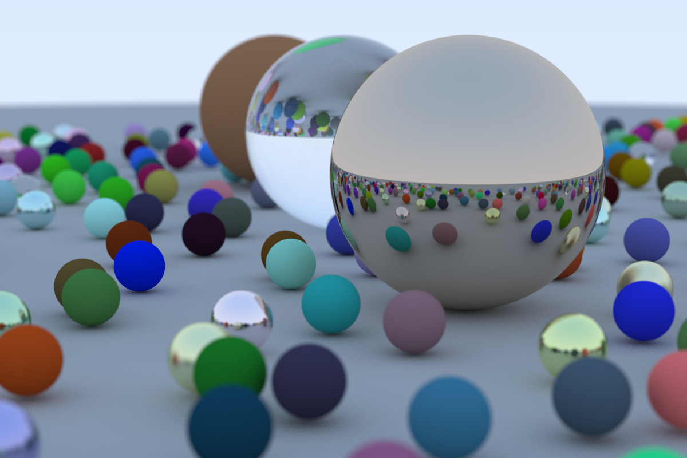

# Shimmer

Shimmer is a CPU-bound ray tracing library.

# Acknowledgements

Shimmer is largely based on Peter Shirley's book [_Ray Tracing in One Weekend_](https://raytracing.github.io/books/RayTracingInOneWeekend.html). I will readily recommend this book to anyone interested in computer graphics, along with his other books [_Ray Tracing: The Next Week_](https://raytracing.github.io/books/RayTracingTheNextWeek.html) and [_Ray Tracing: The Rest of Your Life_](https://raytracing.github.io/books/RayTracingTheRestOfYourLife.html). While the math and basic structure of the library follows Shirley's books, Shimmer expands from the text to add its own features and achieve more idiomatic and maintainable Rust code.