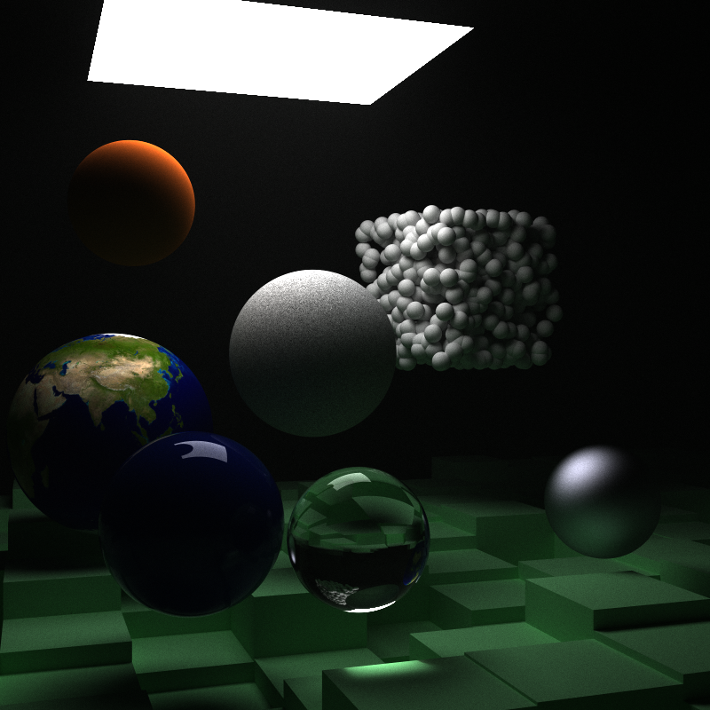
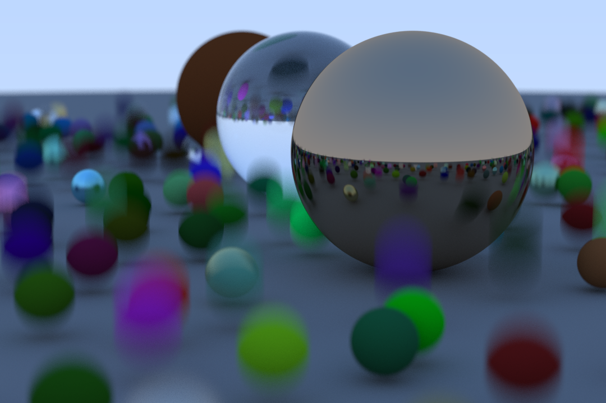

# Ray Tracing in One Weekend, In Rust

This repository is a CPU-bound ray tracing library based on Peter Shirley's books on the topic.

It adds some additional features such as parallel and tiled rendering. I also use it for some ray tracing experiments, such as implementing [hash-based ray path prediction](https://arxiv.org/pdf/1910.01304.pdf) for skipping acceleration structure traversals.

It further makes changes from the books to achieve more idiomatic Rust code where possible.

# Features

* Materials
  * Lambertians
  * Dialectrics
  * Metals
  * Extensible Material trait representation.
  * Isotropic
* Textures
  * Image textures
  * Procedural textures
  * Extensible Texture trait representation.
* Geometry
  * Constant density convex mediums
  * Implicit surfaces (e.g. spheres, rectangles)
  * Motion Blur
* Performance
  * BVH (Bounding Volume Hierarchy) implementation for fast ray collisions.
  * Multi-threaded, tiled rendering
  * Hash-based ray path prediction (experimental)
* Camera
  * Depth of Field
  * Shutter Speed

# Usage

For more details on how to use this crate, run `cargo doc --open` in the cloned repository.

The binary provides a command line interface to rendering sample scenes. To install, while in the cloned repository, use `cargo install --path .`. Then use `shimmer --help` for more informtion. Or, skip installation and run `cargo run -- --help`.

# Sample Renders

A variety of materials.

*Constant Density Mediums*

*Motion blur*

# Acknowledgements

This repository is based on Peter Shirley's book [_Ray Tracing in One Weekend_](https://raytracing.github.io/books/RayTracingInOneWeekend.html). I will readily recommend this book to anyone interested in computer graphics, along with his other books [_Ray Tracing: The Next Week_](https://raytracing.github.io/books/RayTracingTheNextWeek.html) and [_Ray Tracing: The Rest of Your Life_](https://raytracing.github.io/books/RayTracingTheRestOfYourLife.html).

# A note on the "Shimmer" moniker and further development

Some names in this repository reference "shimmer". That was what I originally named this crate, but now [this repository](https://github.com/jalberse/shimmer) holds that moniker, and is where I've directed my interests in rendering.