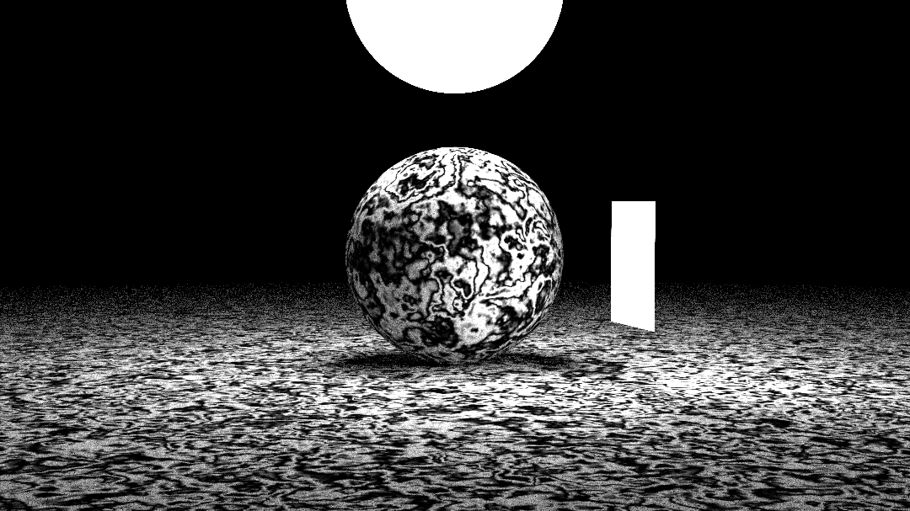

# Shimmer

Shimmer is a CPU-bound ray tracing library.

# Features

* Materials
  * Lambertians
  * Dialectrics
  * Metals
  * Extensible Material trait representation.
* Textures
  * Image textures
  * Procedural textures
  * Extensible Texture trait representation.
* Geometry
  * Implicit surfaces (e.g. spheres, rectangles)
  * Motion Blur
* Performance
  * BVH (Bounding Volume Hierarchy) implementation for fast ray collisions.
  * Multi-threaded, tiled rendering
* Camera
  * Depth of Field
  * Shutter Speed

# Usage

Shimmer is not yet published to crates.io. For use, clone this repository. For more details on how to use this crate, run `cargo doc --open` in the cloned repository.

The Shimmer binary provides a command line interface to rendering sample scenes using Shimmer. To install Shimmer, while in the cloned repository, use `cargo install --path .`. Then use `shimmer --help` for more informtion. Or, skip installation and run `cargo run -- --help`.

# Sample Renders

*Lights and procedural textures*

*Motion blur*

# Acknowledgements

Shimmer is largely based on Peter Shirley's book [_Ray Tracing in One Weekend_](https://raytracing.github.io/books/RayTracingInOneWeekend.html). I will readily recommend this book to anyone interested in computer graphics, along with his other books [_Ray Tracing: The Next Week_](https://raytracing.github.io/books/RayTracingTheNextWeek.html) and [_Ray Tracing: The Rest of Your Life_](https://raytracing.github.io/books/RayTracingTheRestOfYourLife.html). While the math and basic structure of the library follows Shirley's books, Shimmer expands from the text to add its own features and achieve more idiomatic and maintainable Rust code.
